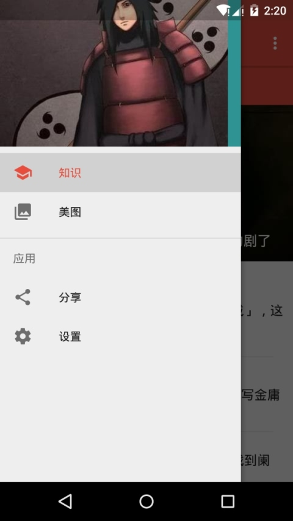

[中文版点我](README.md)
--

##Introduction
Knowledge is an app you can read Zhihu daily and JianDan science articles with. (and browse cute girls pictures :D)
It conforms to Material Design.

##ScreenShots

##You can learn

- Use Android Desgn library
- Write your BaseActivity and BaseFragment
- Apply MVP pattern
- Avoid webview's memory leak
- Use Okhttp to lanuch request
- Parse response with Gson
- Load image with Glide library
- Use Realm to cache data
- Add a Splash page with animation
- Add a Setting Activity
- Add Activity transition animation

##Repositories

    dependencies {
        debugCompile 'com.squareup.leakcanary:leakcanary-android:1.3.1' //help you to find memory leak
        compile 'com.android.support:design:23.1.1'//design widgets
        compile 'com.bigkoo:convenientbanner:2.0.5'//a auto-scroll viewPager banner
        compile 'com.android.support:cardview-v7:23.1.1'
        compile 'com.github.bumptech.glide:glide:3.6.0'//load pictures
        compile 'com.jakewharton:butterknife:7.0.1'//help you saving "findViewById"
        compile 'com.google.code.gson:gson:2.5'
        compile 'com.zhy:okhttputils:2.2.0'
        compile 'com.android.support:recyclerview-v7:23.1.1'
        compile 'io.realm:realm-android:0.87.4'//fast mobile database
        compile 'com.github.orhanobut:logger:1.12'//a beautiful log util
    }

## Support Me
If you like it, get me a drink and I'll do my best to make it better. (Use your Wechat to scan)

